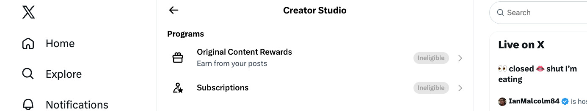

I believe the Charlie Kirk assassination in 2025 uncovers that the U.S. has a puppet master powered by some foreign country's intelligence service that's effectively made Bolsheviks of 2025 over the United States. They have control over our politicians. Epstein Island was part of their puppet master control over our politicians. The assassination of Charlie Kirk by this foreign country's intelligence service was about control over our politicians. 

I ask everybody who has followed the Charlie Kirk assassination to create a "FIX IT PLAN" And I will present mine below.

The goal of this is a strategic view of what we need to do in our country to fix all root causes. The assassinations of Charlie Kirk and Epstein Island are the tip of the iceberg above the water. A foreign country, Bolsheviks 2026. Control over our politicians and our democracy being robbed from us is the iceberg under the water. 

FIX PLAN:

1) We the Citizens (WeTheCitizens.io) measures politicians who appear to be casting votes and passing laws to serve the puppet master and voting against laws that the citizen base needs 
    * This is a way to measure if our democracy has been removed. 
    * This is a way to measure if U.S. politicians are working for somebody, and that is not U.S. citizens. 

2)  We must replace TPUSA:  WeTheCitizens.io is non-partisan.

10. I created a social network that's open source, in order to fix the monetization problems for
    influencers who tell the truth.
11. WeCitizens.social: [https://m.wecitizens.social/](https://m.wecitizens.social/)
12. This is open source code. It also uses an open-standards, peer-to-peer social network backbone.
    That way, the posts are open and transparent. That prevents censorship. The next step is that we

b) they're likely to close accounts or remove monetization from accounts that tell the truth about crimes committed by a puppet master of 2026. 

c) Charlie Kirk was assassinated by some country's intelligence service. This is effectively acting like a puppet master that's like a Bolsheviks 2026. 

d) Epstein Island was also the same thing: Bolsheviks 2026 control over politicians. 

e) all of this is about a Bolsheviks 2026 equivalent of control over politicians. 

f) then this turns against control over influencers on social media that are telling the truth and pointing out the crimes of Bolsheviks in 2025, like the murder of Charlie Kirk. 

g) there have already been reports of a big percentage of top influencers that are conservative in 2025 and are being paid by, likely, a foreign country. The social media monetization systems will keep on for them. 

h) we must have a strategy to fix this problem, and here I am presenting my strategy. 

i) We the Citizens (WeTheCitizens.io) is meant to be a replacement for TPUSA.  WeTheCitizens.io is non-partisan.

j) I created in a social network that's open source, in order to fix the monetization problems for influencers who tell the truth

k) WeCitizens.social: https://m.wecitizens.social/

l) this is open source code. It's also using open standards peer-to-peer social network backbone. That way, the posts are open and transparent. That prevents censorship. The next is we make the algorithm transparent to also prove there's no censorship. 

m) next comes monetization for truth-telling influencers. 

n) We share 40% of revenue with the influencer from users who sign up on their portal. This becomes a very large amount of money very quickly. 

o) I personally don't need monetization myself. You can see the censorship that accounts like mine and others are experiencing by seeing the image below, where they have censored my ability to receive money from X in the way their censorship works. 

